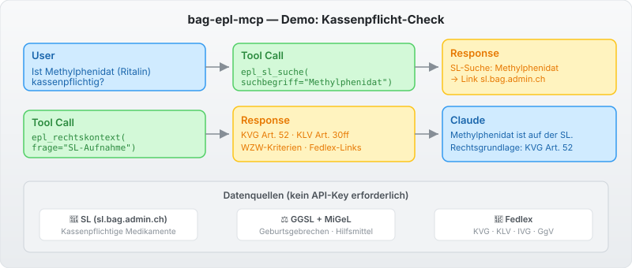

[\U0001f1ec\U0001f1e7 English Version](README.md)

> \U0001f1e8\U0001f1ed **Teil des [Swiss Public Data MCP Portfolios](https://github.com/malkreide)**

# \U0001f48a bag-epl-mcp


[](https://opensource.org/licenses/MIT)
[](https://www.python.org/downloads/)
[](https://modelcontextprotocol.io/)
[](https://github.com/malkreide/bag-epl-mcp)


> MCP-Server fuer die elektronische Plattform Leistungen (ePL) des BAG \u2014 Spezialitaetenliste, GGSL, MiGeL

### Demo



---

## Uebersicht

`bag-epl-mcp` ermoeglicht KI-Modellen, Fragen zur obligatorischen Krankenpflegeversicherung in natuerlicher Sprache zu beantworten \u2014 verankert in echten Daten.

| Liste | Zweck | Rechtsgrundlage |
|-------|-------|-----------------|
| **Spezialitaetenliste (SL)** | Kassenpflichtige Medikamente | KVG Art. 52 |
| **GGSL** | Medikamente bei Geburtsgebrechen (IV) | IVG Anhang |
| **MiGeL** | Medizinprodukte und Hilfsmittel | KLV Art. 20 |

**Anker-Abfrage:** *\u00abIst dieses Medikament kassenpflichtig?\u00bb*
\u2192 `epl_sl_suche`: Direktabfrage in der Spezialitaetenliste (SL)
→ [Weitere Anwendungsbeispiele nach Zielgruppe →](EXAMPLES.md)

---

## Funktionen

- \U0001f48a **6 Tools, 2 Resources, 2 Prompts** fuer Schweizer Gesundheitsdaten
- \U0001f50d **`epl_sl_suche`** \u2014 Medikamentensuche in der Spezialitaetenliste
- \u2696\ufe0f **`epl_rechtskontext`** \u2014 Rechtliche Grundlagen mit Fedlex-Links
- \U0001f513 **Kein API-Schluessel erforderlich** \u2014 alle Daten oeffentlich zugaenglich
- \u2601\ufe0f **Dualer Transport** \u2014 stdio (Claude Desktop) + Streamable HTTP (Cloud)
- \U0001f4da **Prompt-Vorlagen** fuer Kassenpflicht-Checks und Schulgesundheit

---

## Voraussetzungen

- Python 3.11+
- [uv](https://github.com/astral-sh/uv) (empfohlen) oder pip

---

## Installation

```bash
git clone https://github.com/malkreide/bag-epl-mcp.git
cd bag-epl-mcp
pip install -e .
```

Oder mit `uvx`:

```bash
uvx bag-epl-mcp
```

---

## Schnellstart

```bash
# stdio (fuer Claude Desktop) — Default, oeffnet keine Netzwerk-Ports
python -m bag_epl_mcp.server

# Streamable HTTP (Cloud) — Transport-Wahl ueber Env-Variable
MCP_TRANSPORT=streamable-http MCP_HOST=0.0.0.0 MCP_PORT=8000 \
  pip install -e ".[http]" && python -m bag_epl_mcp.server
```

> **Transport und Host werden ausschliesslich ueber Umgebungsvariablen**
> gesteuert (`MCP_TRANSPORT`, `MCP_HOST`, `MCP_PORT`). Default ist `stdio`;
> `MCP_HOST` ist `127.0.0.1` und sollte nur im Container auf `0.0.0.0` gesetzt
> werden. Sicherheitsmodell: siehe [`docs/SECURITY.md`](docs/SECURITY.md).

---

## Verfuegbare Tools

| Tool | Beschreibung |
|------|-------------|
| `epl_sl_suche` | Kassenpflichtige Medikamente in der SL suchen |
| `epl_ggsl_abfrage` | GGSL-Deckung bei Geburtsgebrechen pruefen |
| `epl_migel_suche` | Medizinprodukte in der MiGeL suchen |
| `epl_gesuchseingaenge` | Transparenzliste SL-Neuaufnahmen abrufen |
| `epl_rechtskontext` | Rechtliche Grundlagen zur Kassenpflicht (WZW) |
| `epl_server_info` | Serverstatus und API-Phaseninfo |

---

## Architektur

**Datenfluss (Phase 1):**

```
                         bag-epl-mcp (FastMCP)
 \u250c\u2500\u2500\u2500\u2500\u2500\u2500\u2500\u2500\u2500\u2500\u2500\u2500\u2510  MCP    \u250c\u2500\u2500\u2500\u2500\u2500\u2500\u2500\u2500\u2500\u2500\u2500\u2500\u2500\u2500\u2500\u2500\u2500\u2500\u2500\u2500\u2500\u2500\u2500\u2500\u2500\u2500\u2500\u2500\u2500\u2500\u2500\u2510  HTTPS GET   \u250c\u2500\u2500\u2500\u2500\u2500\u2500\u2500\u2500\u2500\u2500\u2500\u2500\u2500\u2500\u2500\u2500\u2500\u2500\u2510
 \u2502 MCP-Client \u2502\u25c0\u2500\u2500\u2500\u2500\u2500\u2500\u25b6\u2502  Tools (nur lesend)            \u2502\u2500\u2500\u2500\u2500\u2500\u2500\u2500\u2500\u2500\u2500\u2500\u2500\u2500\u25b6\u2502 sl.bag.admin.ch  \u2502
 \u2502 (Claude    \u2502 stdio / \u2502   \u251c\u2500 epl_sl_suche              \u2502  Egress-     \u2502 www.bag.admin.ch \u2502
 \u2502  Desktop,  \u2502 Stream- \u2502   \u251c\u2500 epl_ggsl_abfrage          \u2502  Allow-List  \u2502 www.fedlex...    \u2502
 \u2502  claude.ai)\u2502 able    \u2502   \u251c\u2500 epl_migel_suche           \u2502\u25c0\u2500\u2500\u2500\u2500\u2500\u2500\u2500\u2500\u2500\u2500\u2500\u2500\u2500\u2502 (oeffentl. OGD)  \u2502
 \u2502            \u2502 HTTP    \u2502   \u251c\u2500 epl_gesuchseingaenge       \u2502  (keine Auth)\u2514\u2500\u2500\u2500\u2500\u2500\u2500\u2500\u2500\u2500\u2500\u2500\u2500\u2500\u2500\u2500\u2500\u2500\u2500\u2518
 \u2502            \u2502         \u2502   \u251c\u2500 epl_rechtskontext          \u2502
 \u2502            \u2502         \u2502   \u2514\u2500 epl_server_info            \u2502   strukturierte JSON-Logs \u2192 stderr
 \u2514\u2500\u2500\u2500\u2500\u2500\u2500\u2500\u2500\u2500\u2500\u2500\u2500\u2518         \u2514\u2500\u2500\u2500\u2500\u2500\u2500\u2500\u2500\u2500\u2500\u2500\u2500\u2500\u2500\u2500\u2500\u2500\u2500\u2500\u2500\u2500\u2500\u2500\u2500\u2500\u2500\u2500\u2500\u2500\u2500\u2500\u2518
```

**Phasenplan** (Details in [`docs/ROADMAP.md`](docs/ROADMAP.md)):

```
Phase 1 (aktuell)  \u2192 SL-Website-Zugriff + strukturierte Rechtsinfo
Phase 2 (geplant)  \u2192 FHIR/IDMP-API (BAG, ~2025/2026)
Phase 3 (Vision)   \u2192 MiGeL + AL via ePL-FHIR (2026/2027)
```

**MCP-Protokoll-Version:** `2025-06-18` (via `epl_server_info`). SDK-Updates
werden monatlich via Dependabot vorgeschlagen.

---

## Sicherheit & Grenzen

- **Nur lesend:** Alle Tools fuehren ausschliesslich HTTP-GET-Anfragen aus \u2014 keine Daten werden geschrieben, geaendert oder geloescht.
- **Keine Personendaten:** Der Server greift auf oeffentliche Regulierungslisten (SL, GGSL, MiGeL) zu. Es werden keine personenbezogenen Daten (PII) verarbeitet oder gespeichert.
- **Keine medizinische Beratung:** Dieser Server bietet rein informativen Zugang zu regulatorischen Daten. Fuer medizinische oder rechtliche Entscheidungen konsultieren Sie die offiziellen BAG-Quellen und qualifizierte Fachpersonen.
- **Rate Limits:** Die SL-Website (sl.bag.admin.ch) ist eine oeffentliche Angular-SPA; der Server erzwingt ein 30s-Timeout pro Anfrage. Verwenden Sie `limit`-Parameter konservativ.
- **Datenfische:** Phase-1-Tools verlinken auf Live-BAG-Quellen. Kein Caching durch diesen Server.
- **Datenlizenz (OGD-CH):** Die zugrundeliegenden BAG-/Fedlex-Daten sind Swiss Open Government Data, lizenziert unter **CC BY 4.0**. Tool-Antworten fuehren einen `source`/`provenance`-Block (JSON) bzw. eine Quellen-/Lizenz-Fusszeile (Markdown), damit die Attribution erhalten bleibt.
- **Nutzungsbedingungen:** Daten unterliegen den Nutzungsbedingungen von [sl.bag.admin.ch](https://sl.bag.admin.ch), [bag.admin.ch](https://www.bag.admin.ch) und [fedlex.admin.ch](https://www.fedlex.admin.ch).
- **Keine Garantie:** Community-Projekt, nicht affiliiert mit dem BAG oder einer Behoerde. Verfuegbarkeit haengt von den Upstream-Quellen ab.

---

## Tests

```bash
PYTHONPATH=src pytest tests/ -m "not live"
```

---

## Changelog

Siehe [CHANGELOG.md](CHANGELOG.md)

---

## Mitwirken

Siehe [CONTRIBUTING.md](CONTRIBUTING.md)

---

## Lizenz

MIT-Lizenz \u2014 siehe [LICENSE](LICENSE)

---

## Autor

Hayal Oezkan \u00b7 [malkreide](https://github.com/malkreide)

---

## Credits & Verwandte Projekte

- **BAG Spezialitaetenliste:** [sl.bag.admin.ch](https://sl.bag.admin.ch) \u2014 Bundesamt fuer Gesundheit
- **KVG:** [SR 832.10](https://www.fedlex.admin.ch/eli/cc/1995/1328_1328_1328/de) \u2014 Krankenversicherungsgesetz
- **KLV:** [SR 832.112.31](https://www.fedlex.admin.ch/eli/cc/1995/4964_4964_4964/de) \u2014 Krankenpflege-Leistungsverordnung
- **Protokoll:** [Model Context Protocol](https://modelcontextprotocol.io/) \u2014 Anthropic / Linux Foundation
- **Verwandt:** [fedlex-mcp](https://github.com/malkreide/fedlex-mcp) \u2014 Schweizer Bundesrecht
- **Verwandt:** [swiss-cultural-heritage-mcp](https://github.com/malkreide/swiss-cultural-heritage-mcp) \u2014 Kulturerbe-Daten
- **Portfolio:** [Swiss Public Data MCP Portfolio](https://github.com/malkreide)
