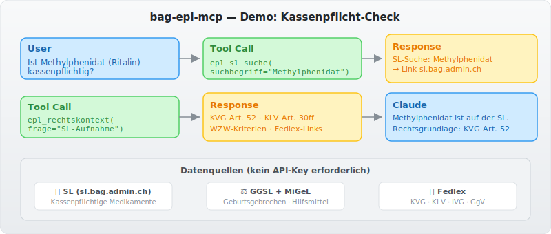

> \U0001f1e8\U0001f1ed **Part of the [Swiss Public Data MCP Portfolio](https://github.com/malkreide)**

# \U0001f48a bag-epl-mcp


[](https://opensource.org/licenses/MIT)
[](https://www.python.org/downloads/)
[](https://modelcontextprotocol.io/)
[](https://github.com/malkreide/bag-epl-mcp)


> MCP Server for the Swiss BAG electronic benefits platform (ePL) \u2014 Spezialitaetenliste, GGSL, MiGeL

[\U0001f1e9\U0001f1ea Deutsche Version](README.de.md)

### Demo



---

## Overview

`bag-epl-mcp` enables AI models to answer questions about mandatory health insurance coverage in Switzerland \u2014 in natural language, grounded in real data.

| List | Purpose | Legal basis |
|------|---------|-------------|
| **Spezialitaetenliste (SL)** | Compulsory-insurance medications | KVG Art. 52 |
| **GGSL** | Medications for congenital disorders (IV) | IVG Anhang |
| **MiGeL** | Medical devices & aids | KLV Art. 20 |

**Anchor query:** *"Is this medication covered by mandatory health insurance?"*
\u2192 `epl_sl_suche`: Live lookup in the Spezialitaetenliste (SL)

---

## Features

- \U0001f48a **6 tools, 2 resources, 2 prompts** for Swiss health insurance data
- \U0001f50d **`epl_sl_suche`** \u2014 search the Spezialitaetenliste for medications
- \u2696\ufe0f **`epl_rechtskontext`** \u2014 legal context with Fedlex links
- \U0001f513 **No API key required** \u2014 all data publicly accessible
- \u2601\ufe0f **Dual transport** \u2014 stdio (Claude Desktop) + Streamable HTTP (cloud)
- \U0001f4da **Prompt templates** for insurance coverage checks and school health queries

---

## Prerequisites

- Python 3.11+
- [uv](https://github.com/astral-sh/uv) (recommended) or pip

---

## Installation

```bash
# Clone the repository
git clone https://github.com/malkreide/bag-epl-mcp.git
cd bag-epl-mcp

# Install
pip install -e .
# or with uv:
uv pip install -e .
```

Or with `uvx` (no permanent installation):

```bash
uvx bag-epl-mcp
```

---

## Quickstart

```bash
# stdio (for Claude Desktop)
python -m bag_epl_mcp.server

# Streamable HTTP (port 8000)
python -m bag_epl_mcp.server --http --port 8000
```

Try it immediately in Claude Desktop:

> *"Is Methylphenidate (Ritalin) covered by mandatory health insurance?"*
> *"Which laws regulate admission to the Spezialitaetenliste?"*
> *"Is a wheelchair covered by mandatory insurance?"*

---

## Configuration

### Claude Desktop

Edit `~/Library/Application Support/Claude/claude_desktop_config.json` (macOS) or `%APPDATA%\Claude\claude_desktop_config.json` (Windows):

```json
{
  "mcpServers": {
    "bag-epl": {
      "command": "python",
      "args": ["-m", "bag_epl_mcp.server"]
    }
  }
}
```

Or with `uvx`:

```json
{
  "mcpServers": {
    "bag-epl": {
      "command": "uvx",
      "args": ["bag-epl-mcp"]
    }
  }
}
```

### Cloud Deployment (SSE for browser access)

**Render.com (recommended):**
1. Push/fork the repository to GitHub
2. On [render.com](https://render.com): New Web Service \u2192 connect GitHub repo
3. Set start command: `python -m bag_epl_mcp.server --http --port 8000`
4. In claude.ai under Settings \u2192 MCP Servers, add: `https://your-app.onrender.com/sse`

---

## Available Tools

| Tool | Description |
|------|-------------|
| `epl_sl_suche` | Search the Spezialitaetenliste for compulsory-insurance medications |
| `epl_ggsl_abfrage` | Check GGSL coverage for congenital disorders |
| `epl_migel_suche` | Search the MiGeL for medical devices & aids |
| `epl_gesuchseingaenge` | List pending SL admission requests (transparency) |
| `epl_rechtskontext` | Legal context for coverage questions (WZW criteria) |
| `epl_server_info` | Server status and API phase information |

### Example Use Cases

| Query | Tool |
|-------|------|
| *"Is Ritalin covered by insurance?"* | `epl_sl_suche` |
| *"Which medications for congenital disorder GG-313?"* | `epl_ggsl_abfrage` |
| *"Is a wheelchair covered?"* | `epl_migel_suche` |
| *"Which laws regulate the SL?"* | `epl_rechtskontext` |

---

## Architecture

```
Phase 1 (current)  \u2192 SL website access + structured legal info
Phase 2 (planned)  \u2192 FHIR/IDMP API (BAG, ~2025/2026)
Phase 3 (vision)   \u2192 MiGeL + AL via ePL-FHIR (2026/2027)
```

The server is **already useful today** and will seamlessly upgrade when the BAG publishes its FHIR API.

---

## Safety & Limits

- **Read-only:** All tools perform HTTP GET requests only \u2014 no data is written, modified, or deleted.
- **No personal data:** The server accesses public regulatory lists (SL, GGSL, MiGeL). No personally identifiable information (PII) is processed or stored.
- **No medical advice:** This server provides informational access to regulatory data only. For medical or legal decisions, always consult the official BAG sources and qualified professionals.
- **Rate limits:** The SL website (sl.bag.admin.ch) is a public Angular SPA; the server enforces a 30s timeout per request. Use `limit` parameters conservatively.
- **Data freshness:** Phase 1 tools link to live BAG sources. No caching is performed by this server.
- **Terms of service:** Data is subject to the ToS of [sl.bag.admin.ch](https://sl.bag.admin.ch), [bag.admin.ch](https://www.bag.admin.ch), and [fedlex.admin.ch](https://www.fedlex.admin.ch).
- **No guarantees:** This is a community project, not affiliated with the BAG or any government entity. Availability depends on upstream sources.

---

## Testing

```bash
# Unit tests (no API key required)
PYTHONPATH=src pytest tests/ -m "not live"

# Integration tests (live API calls)
pytest tests/ -m "live"
```

---

## Changelog

See [CHANGELOG.md](CHANGELOG.md)

---

## Contributing

See [CONTRIBUTING.md](CONTRIBUTING.md)

---

## License

MIT License \u2014 see [LICENSE](LICENSE)

---

## Author

Hayal Oezkan \u00b7 [malkreide](https://github.com/malkreide)

---

## Credits & Related Projects

- **BAG Spezialitaetenliste:** [sl.bag.admin.ch](https://sl.bag.admin.ch) \u2014 Federal Office of Public Health
- **KVG:** [SR 832.10](https://www.fedlex.admin.ch/eli/cc/1995/1328_1328_1328/de) \u2014 Health Insurance Act
- **KLV:** [SR 832.112.31](https://www.fedlex.admin.ch/eli/cc/1995/4964_4964_4964/de) \u2014 Healthcare Benefits Ordinance
- **Protocol:** [Model Context Protocol](https://modelcontextprotocol.io/) \u2014 Anthropic / Linux Foundation
- **Related:** [fedlex-mcp](https://github.com/malkreide/fedlex-mcp) \u2014 Swiss federal law
- **Related:** [swiss-cultural-heritage-mcp](https://github.com/malkreide/swiss-cultural-heritage-mcp) \u2014 Cultural heritage data
- **Portfolio:** [Swiss Public Data MCP Portfolio](https://github.com/malkreide)
